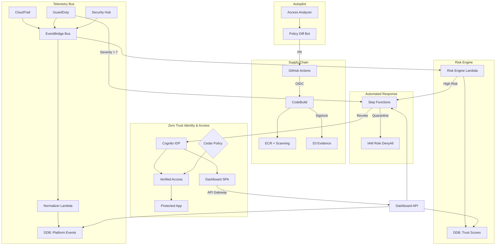

# Prahari Platform Architecture

Prahari is a Zero Trust Access & Governance platform for AWS. It is composed of 7 distinct modules.

## Architecture Diagram

## Module Overview

1. **Supply Chain**: Prevents untrusted code from running. Validates SBOMs and enforces artifact signing via Sigstore.
2. **Least-Privilege Autopilot**: Uses IAM Access Analyzer to generate right-sized policies based on CloudTrail usage, opening a GitHub PR instead of auto-applying.
3. **Signal Bus**: A central EventBridge bus that normalizes GuardDuty, Security Hub, and CloudTrail events into a single schema.
4. **ZTNA Broker**: Replaces VPNs with AWS Verified Access, gated by Cedar policies and Cognito identity.
5. **Risk Engine**: Continuously evaluates user trust scores based on telemetry.
6. **Automated Response**: A Step Functions playbook that quarantines IAM roles and revokes Cognito sessions on high-risk events.
7. **Dashboard**: A React SPA hosted on CloudFront providing a single pane of glass for security analysts.
