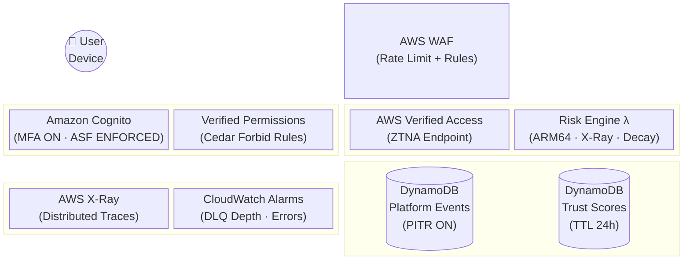
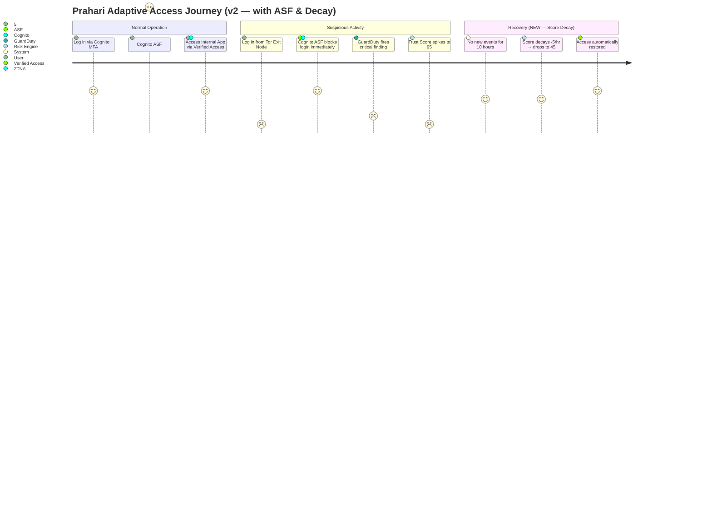
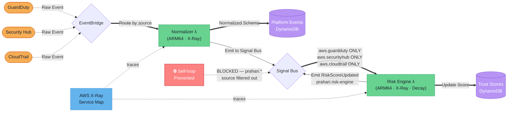
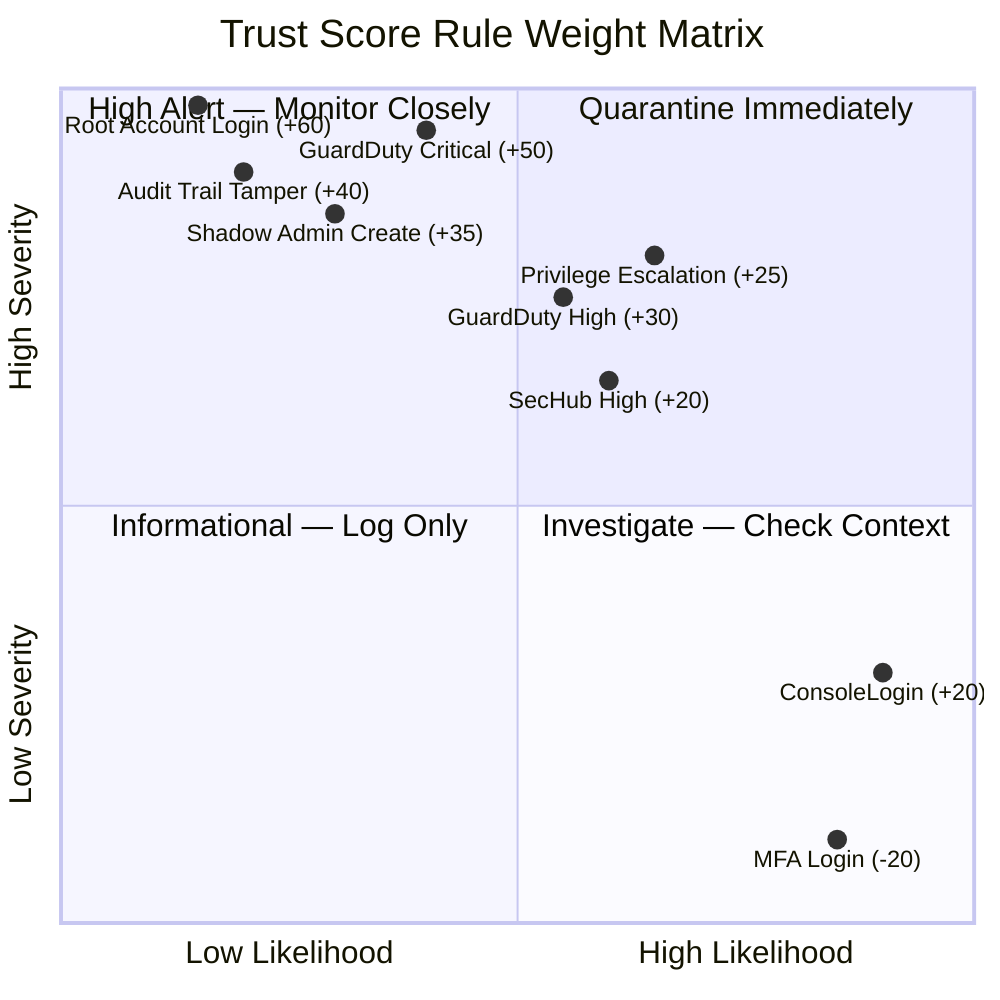
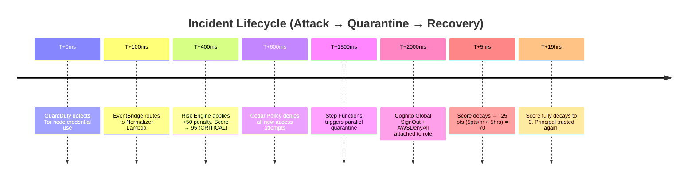
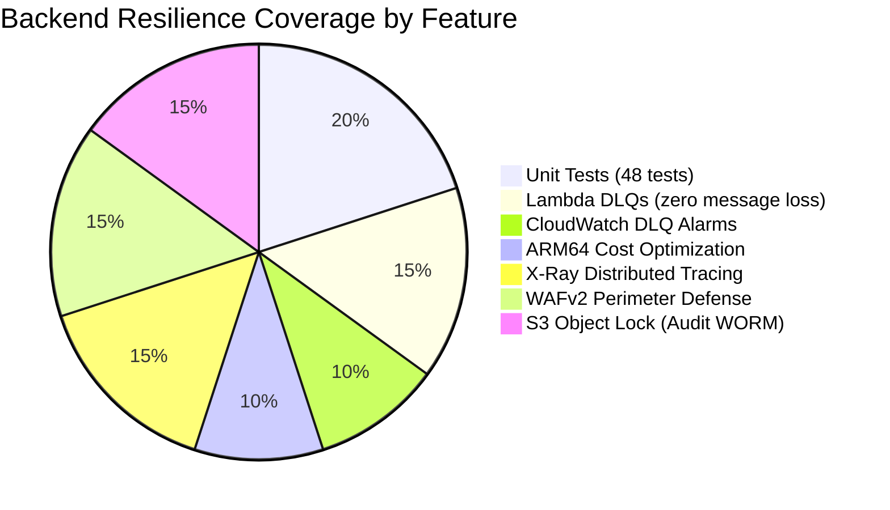
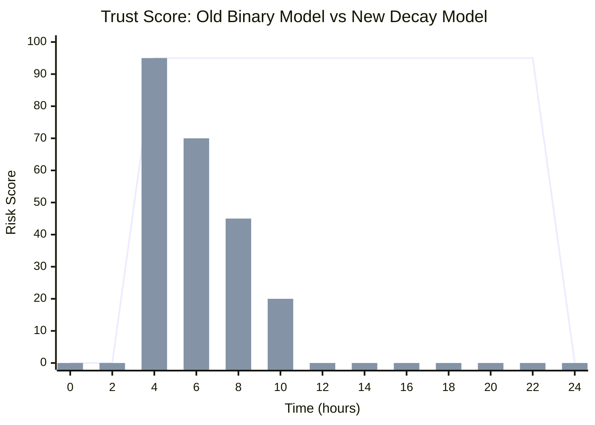
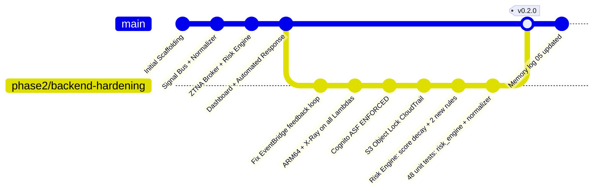

# Prahari Architecture: Alternative & Styled Diagrams (v2)

This document reflects the **fully hardened, production-grade** state of the Prahari ZTNA platform after Phase 2 backend strengthening. All diagrams have been updated to show new components: X-Ray tracing, score decay, ARM64 Lambdas, Cognito ASF, Object Lock, unit tests, and the fixed EventBridge routing.

---

## 1. System Architecture Overview (Block-Beta)
Spatial layout of all platform components after full hardening.



---

## 2. Zero Trust User Journey (with Adaptive Auth)
The end-to-end adaptive experience — now including Cognito ASF blocking Tor nodes.



---

## 3. Telemetry Pipeline with X-Ray Tracing
The full event flow with the feedback-loop fix and distributed tracing.



---

## 4. Trust Score Model (Quadrant Risk Matrix)
Updated to include 2 new scoring rules added in Phase 2.



---

## 5. Incident Response Timeline (Full Platform)
End-to-end sub-second response with score decay showing user recovery.



---

## 6. Backend Resilience Architecture (Pie Chart)
Breakdown of resilience mechanisms added across all phases.



---

## 7. Dynamic Trust Score Simulation (Before vs After Decay)
Comparing the old binary TTL model vs the new continuous decay model.


*(Line = old 24h TTL model. Bar = new -5pts/hour decay model. User recovers in ~19h instead of 24h.)*

---

## 8. Test Coverage GitGraph
How unit tests were introduced via a clean branch and merged.



---

## 9. Automated Response State Machine (With Recovery Path)
Updated state diagram showing the quarantine + recovery lifecycle.

```mermaid
stateDiagram-v2
    classDef critical fill:#ef4444,color:white,font-weight:bold,stroke:#7f1d1d
    classDef pass    fill:#22c55e,color:white,stroke:#14532d
    classDef decay   fill:#3b82f6,color:white,stroke:#1e3a8a

    [*] --> EvaluateScore
    EvaluateScore --> BelowThreshold:::pass  : Score < 50
    EvaluateScore --> Quarantine:::critical  : Score ≥ 80

    state Quarantine {
        --
        RevokeSession : Cognito GlobalSignOut
        AttachDenyPolicy : IAM AWSDenyAll
    }

    BelowThreshold --> Monitor:::decay
    Monitor:::decay --> Decay : -5pts/hour applied
    Decay --> BelowThreshold : Score hits 0
    Quarantine --> Decay:::decay : Admin manually clears flag
    Decay --> [*]
```

---

## 10. Security Control Coverage Map
Full mapping of STRIDE threats → mitigations deployed across all phases.

```mermaid
requirementDiagram
    requirement no_static_keys {
        id: 1
        text: No static AWS keys anywhere in pipeline
        risk: high
        verifymethod: analysis
    }
    element oidc_federation {
        type: OIDC GitHub Actions
    }
    oidc_federation - satisfies -> no_static_keys

    requirement mfa_required {
        id: 2
        text: All users must use MFA + adaptive auth
        risk: high
        verifymethod: test
    }
    element cognito_asf {
        type: Cognito MFA=ON + ASF=ENFORCED
    }
    cognito_asf - satisfies -> mfa_required

    requirement tamper_proof_logs {
        id: 3
        text: Audit logs cannot be deleted by any principal
        risk: high
        verifymethod: inspection
    }
    element s3_object_lock {
        type: S3 Object Lock WORM
    }
    s3_object_lock - satisfies -> tamper_proof_logs

    requirement no_event_loss {
        id: 4
        text: No security events silently dropped
        risk: medium
        verifymethod: test
    }
    element sqs_dlq {
        type: SQS DLQ + CW Alarms
    }
    sqs_dlq - satisfies -> no_event_loss
```
