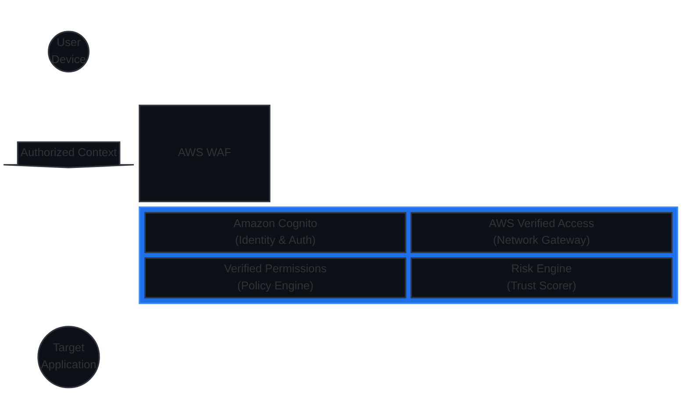
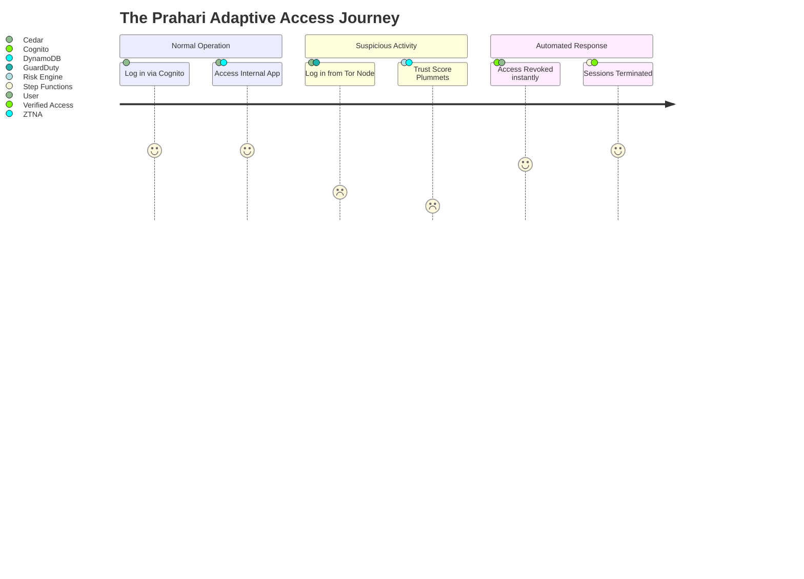
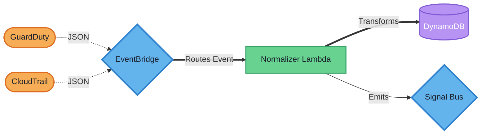
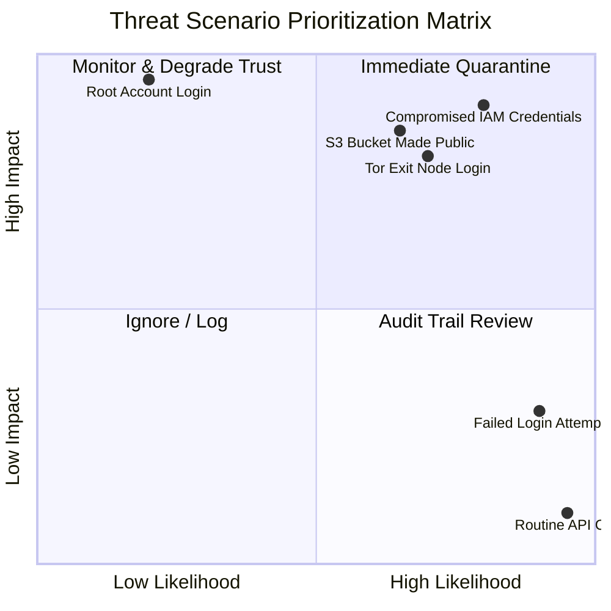
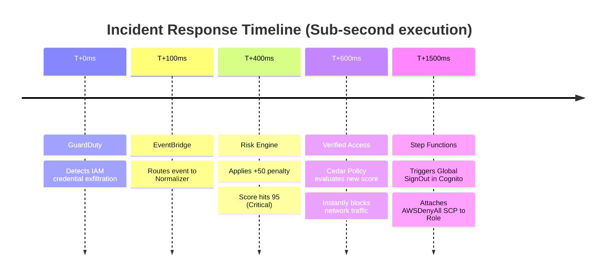
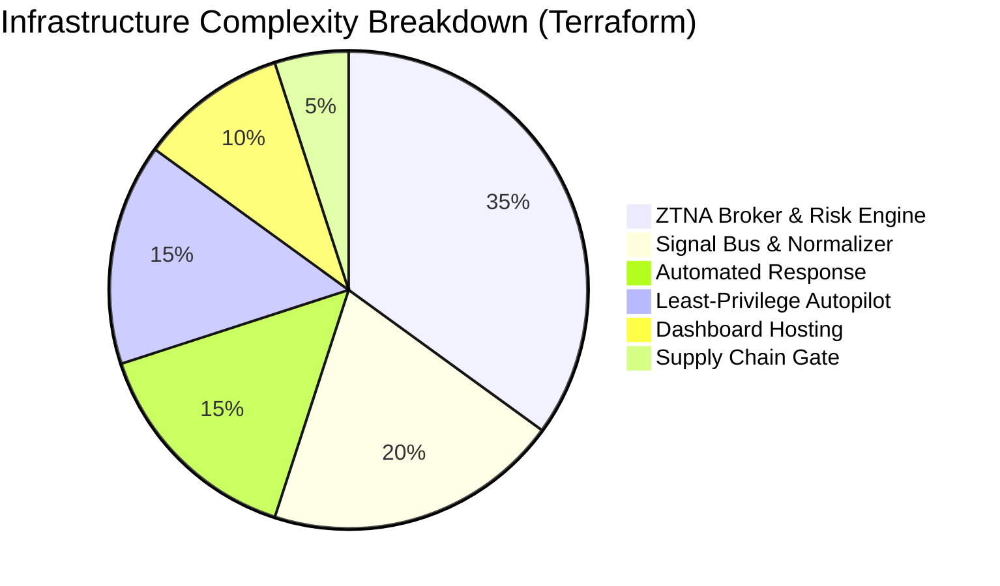
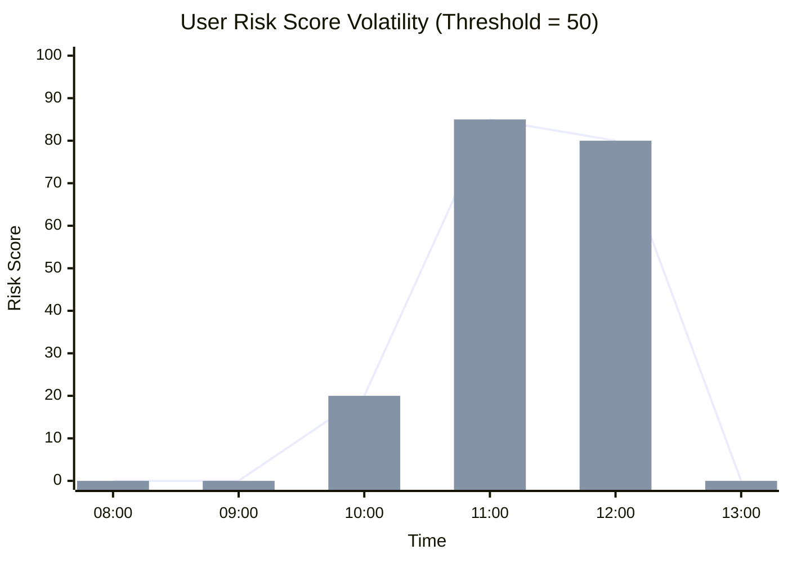
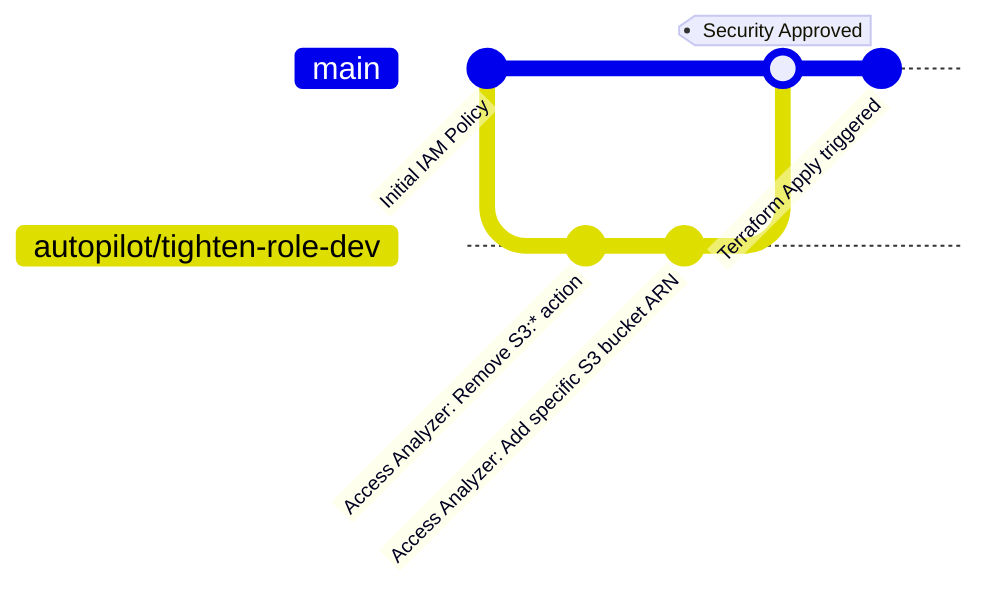
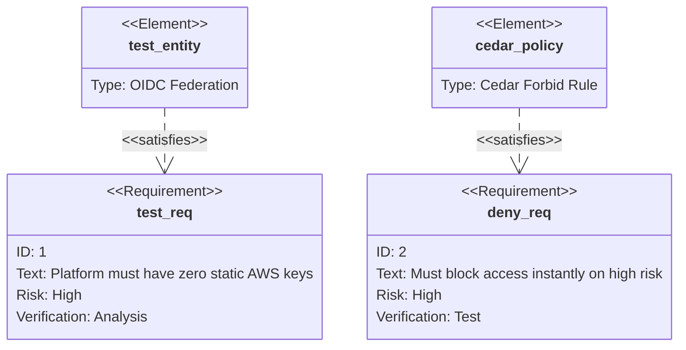

# Prahari Architecture: Alternative & Styled Diagrams

This document explores the Prahari ZTNA platform using completely different diagram styles, utilizing advanced Mermaid features (like Block architecture, Timelines, Quadrant Charts, XY Charts, and GitGraphs) along with custom CSS themes to provide a highly distinct visual experience.

---

## 1. System Block Architecture (Block-Beta)
A modern, structural block diagram showing the spatial relationship of the core components.



---

## 2. Zero Trust User Journey
A journey map tracking a user's experience as their trust score fluctuates and they are eventually blocked.



---

## 3. Styled Data Pipeline (Themed Flowchart)
A standard flowchart entirely restyled with custom colors, dashed lines, and varied node shapes.



---

## 4. Threat Prioritization Matrix (Quadrant Chart)
A strategic view of how Prahari prioritizes different security events.



---

## 5. Threat Response Timeline
A chronological view of an automated response happening in milliseconds.



---

## 6. Project Complexity Distribution (Pie Chart)
A breakdown of the relative code and configuration footprint of the platform.



---

## 7. Dynamic Trust Score Simulation (XY Chart)
A visual chart tracking a hypothetical user's risk score over a 5-hour period.


*(Explanation: Normal activity at 8-9am. Unusual login at 10am bumps score to 20. Critical GuardDuty alert at 11am spikes score to 85, triggering immediate blockade. Admin resets score at 1pm).*

---

## 8. Least-Privilege GitOps Loop (GitGraph)
Visualizing how the Autopilot bot proposes IAM changes via Git branches instead of applying them directly.



---

## 9. State Machine Process Map (Themed StateDiagram)
A distinct visual mapping of the Step Functions quarantine logic using concurrent blocks.

```mermaid
stateDiagram-v2
    classDef critical fill:#ef4444,color:white,font-weight:bold,stroke-width:2px,stroke:#7f1d1d
    classDef pass fill:#22c55e,color:white,stroke:#14532d
    
    state "Evaluate Signal" as Eval
    state "Score > 80?" as Check
    
    [*] --> Eval
    Eval --> Check
    Check --> Safe:::pass : NO
    Check --> Quarantine_Sequence:::critical : YES
    
    state Quarantine_Sequence {
        state "Identity Lockdown" as Id
        state "AWS API Lockdown" as API
        --
        [*] --> Id
        Id --> RevokeCognitoTokens
        --
        [*] --> API
        API --> AttachDenyAllPolicy
    }
    
    Safe --> [*]
    Quarantine_Sequence --> [*]
```

---

## 10. Architectural Layering (Requirement Map)
Mapping out how requirements are satisfied by specific testable elements.


