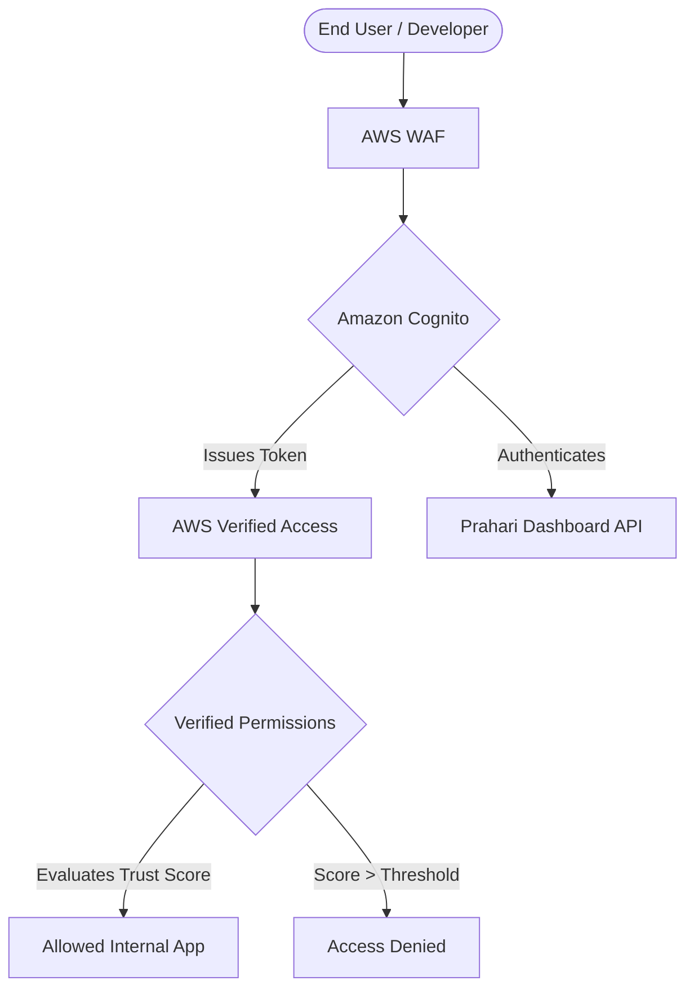
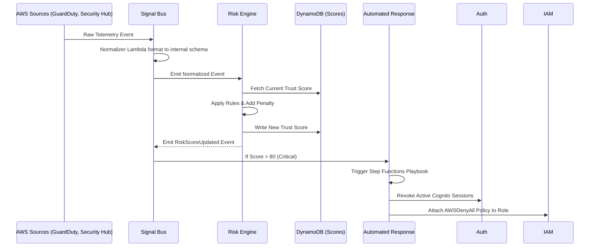
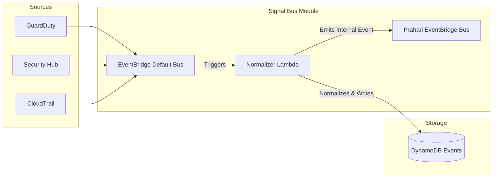
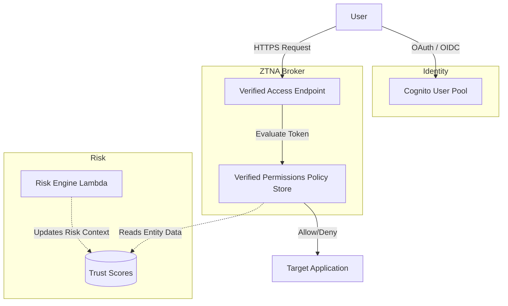
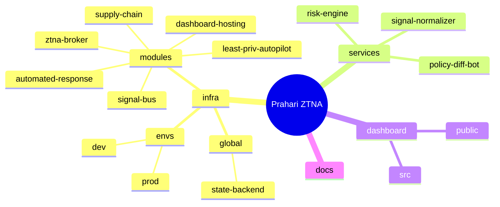
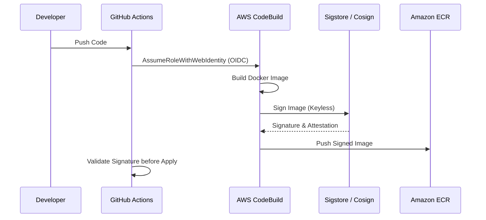
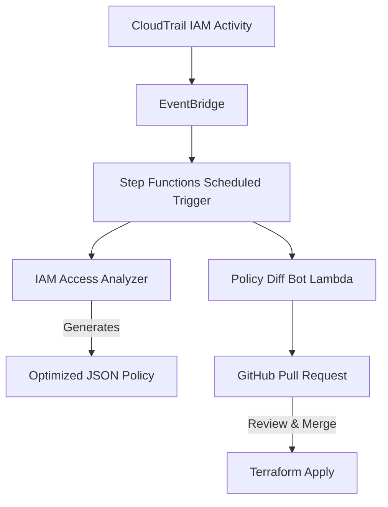
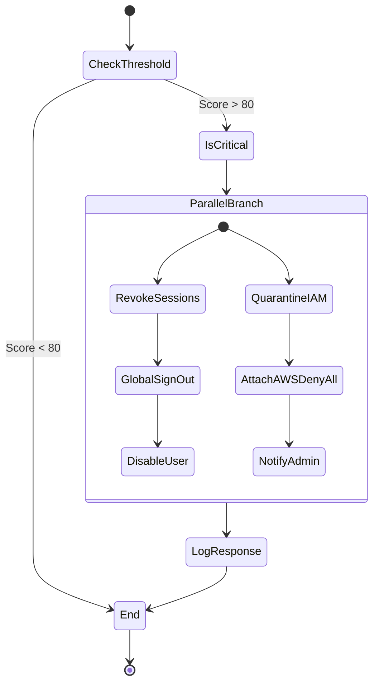
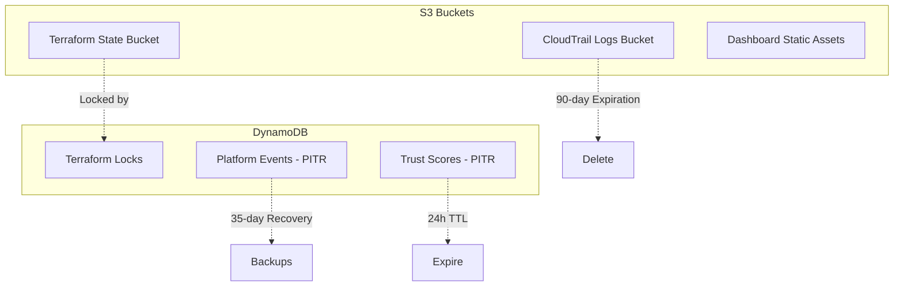

# Prahari Architecture Diagrams

This document contains 10 comprehensive diagrams detailing the architecture, data flows, lifecycles, and security posture of the Prahari ZTNA platform.

---

## 1. System Overview Flow
This diagram illustrates the high-level flow of a user accessing the environment through the Zero Trust components.



---

## 2. Module Execution Lifecycle (Telemetry to Response)
The end-to-end lifecycle of a security event, from detection to automated quarantine.



---

## 3. Internal Module Architecture: Signal Bus
How the central telemetry router handles noisy AWS logs.



---

## 4. Internal Module Architecture: ZTNA Broker
The Zero Trust Network Access evaluation engine.



---

## 5. Project Directory Map
A logical mapping of the Terraform repository structure.



---

## 6. Security Threat Coverage Map
Mapping STRIDE threats to Prahari's mitigation components.

```mermaid
graph TD
    subgraph Threats (STRIDE)
    S[Spoofing]
    T[Tampering]
    R[Repudiation]
    I[Information Disclosure]
    D[Denial of Service]
    E[Elevation of Privilege]
    end

    subgraph Mitigations
    MFA[Cognito MFA & Identity]
    SIG[Sigstore Keyless Signing]
    CT[CloudTrail Logs & S3 Locks]
    TLS[Verified Access HTTPS/TLS]
    WAF[WAF Rate Limiting]
    LPA[Least-Privilege Autopilot]
    end

    S --> MFA
    T --> SIG
    R --> CT
    I --> TLS
    D --> WAF
    E --> LPA
```

---

## 7. Supply Chain Gate Lifecycle
How code transitions from a commit to a verified deployment.



---

## 8. Least-Privilege Autopilot Flow
The continuous GitOps loop for tightening IAM permissions.



---

## 9. Automated Response Playbook
The internal logic of the Step Functions quarantine state machine.



---

## 10. Data & Persistence Layer
How state, logs, and telemetry are persisted and protected.


